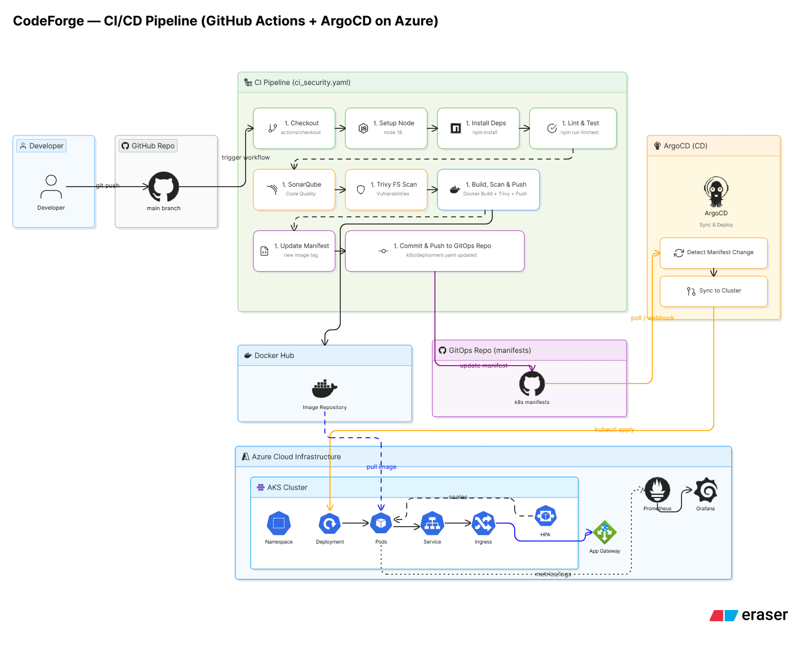

# 🔧 CodeForge — Multi-Tier Coding Platform

> A production-ready, DevSecOps-hardened coding platform built with React, Node.js/Express, PostgreSQL, and Redis — containerised with Docker, deployable on Kubernetes via Helm, and secured through a fully automated CI/CD pipeline.



---

## 📑 Table of Contents

- [Overview](#-overview)
- [Architecture](#-architecture)
- [Tech Stack](#-tech-stack)
- [Project Structure](#-project-structure)
- [Quick Start](#-quick-start)
  - [Docker (Recommended)](#run-with-docker-recommended)
- [Kubernetes Deployment](#-kubernetes-deployment)
  - [Raw Manifests](#option-1-raw-kubernetes-manifests)
  - [Helm Chart](#option-2-helm-chart-recommended)
- [Observability Stack](#-observability-stack)
- [Infrastructure (Terraform)](#-infrastructure-terraform--azure-aks)
- [CI/CD Pipeline](#-cicd-pipeline)
- [Environment Variables](#-environment-variables)
- [Contributing](#-contributing)

---

## 🧭 Overview

CodeForge is a full-stack competitive coding platform where users can:

- Browse and solve coding challenges through an in-browser Monaco editor
- Submit code that is evaluated asynchronously via a Redis job queue
- View real-time submission status through result polling
- Track their scores and ranking on a live leaderboard

The project is designed as a **DevSecOps reference implementation**, demonstrating a complete journey from local Docker Compose to a production-grade Kubernetes cluster on Azure AKS, with security baked into every stage of the pipeline.

---

## 🏗️ Architecture

```
┌──────────────────────────────────────────────────────────────────┐
│                        CODEFORGE PLATFORM                        │
├──────────────┬───────────────┬──────────────┬────────────────────┤
│   TIER 1     │    TIER 2     │   TIER 3     │      TIER 4        │
│  Frontend    │  Backend API  │  PostgreSQL  │      Redis         │
│  React +     │  Node.js +    │  Database    │  Cache + Job Queue │
│  Monaco +    │  Express      │              │                    │
│  Nginx       │               │              │                    │
├──────────────┴───────────────┴──────────────┴────────────────────┤
│                       Code Execution Worker                      │
│                                                                  │
└──────────────────────────────────────────────────────────────────┘
```

### Services

| Service    | Technology            | Port | Role                                        |
|------------|-----------------------|------|---------------------------------------------|
| `frontend` | React + Nginx         | 3000 | Monaco editor UI, routing, JWT auth         |
| `backend`  | Node.js + Express     | 5000 | REST API, authentication, business logic    |
| `postgres` | PostgreSQL 15         | 5432 | Users, challenges, submissions persistence  |
| `redis`    | Redis 7               | 6379 | Session cache, JWT blacklist, job queue     |
| `worker`   | Node.js               | —    | Async code evaluation via Redis queue       |

---

## 🛠️ Tech Stack

| Layer           | Technology                                                   |
|-----------------|--------------------------------------------------------------|
| Frontend        | React, Monaco Editor, Axios, Nginx                           |
| Backend         | Node.js, Express, JWT, Winston                               |
| Database        | PostgreSQL 15                                                |
| Cache / Queue   | Redis 7                                                      |
| Containerisation| Docker, Docker Compose                                       |
| Orchestration   | Kubernetes, Helm                                             |
| Cloud           | Azure AKS (via Terraform)                                    |
| CI/CD           | GitHub Actions                                               |
| Security        | GitLeaks, Semgrep (SAST), Trivy, OWASP Dependency-Check      |
| Observability   | Prometheus, Grafana, Alertmanager (kube-prometheus-stack)    |
| GitOps          | Argo CD                                                      |
| Ingress         | NGINX Ingress                                                |
| Gateway Api     | NGINX Gateway Fabric                                         |

---

## 📁 Project Structure

```
codeforge/
├── docker-compose.yml              # Local orchestration of all 5 services
│
├── frontend/                       # TIER 1 — React Application
│   ├── src/
│   │   ├── App.js                  # Router + auth wrapper
│   │   ├── api.js                  # Axios client with JWT interceptors
│   │   ├── context/
│   │   │   └── AuthContext.js      # Global authentication state
│   │   ├── components/
│   │   │   └── Navbar.js
│   │   └── pages/
│   │       ├── Home.js
│   │       ├── Challenges.js
│   │       ├── Editor.js           # Monaco editor + submission polling
│   │       ├── Login.js
│   │       ├── Register.js
│   │       └── Leaderboard.js
│   ├── Dockerfile                  # Multi-stage: build → Nginx serve
│   ├── .env.example
│   └── nginx.conf                  # Reverse proxy + security headers
│
├── backend/                        # TIER 2 — Express REST API
│   ├── server.js                   # App bootstrap, middleware, routes
│   ├── routes/
│   │   ├── auth.js                 # Register, login, logout, /me
│   │   ├── challenges.js           # Challenge list + detail (Redis-cached)
│   │   ├── submissions.js          # Submit code, poll results
│   │   ├── users.js                # Leaderboard + profiles
│   │   └── health.js               # Health check endpoint
│   ├── middleware/
│   │   └── auth.js                 # JWT verification + Redis blacklist
│   ├── config/
│   │   ├── db.js                   # PostgreSQL connection pool
│   │   ├── redis.js                # Redis client + cache helpers
│   │   ├── logger.js               # Winston structured logging
│   │   └── init.sql                # DB schema + seed data
│   ├── package.json
│   └── Dockerfile                  # Multi-stage Node.js build
│
├── worker/                         # Code Execution Worker
│   ├── worker.js                   # Redis BRPOP queue consumer
│   ├── package.json
│   └── Dockerfile
│
├── k8s/                            # Raw Kubernetes manifests
│   ├── namespace.yaml
│   ├── configmap.yaml
│   ├── secrets.yaml
│   ├── network-policies.yaml       # Default-deny + explicit allow rules
│   ├── frontend.yaml
│   ├── backend.yaml
│   ├── worker.yaml
│   ├── postgres.yaml
│   ├── redis.yaml
│   └── ingress.yaml
│
├── helm/                           # Helm chart for parameterised deployment
│   └── codeforge/
│       ├── Chart.yaml
│       ├── values-dev.yaml         # Dev environment overrides
│       ├── values-prod.yaml        # Production environment overrides
│       └── templates/
│           ├── frontend.yaml
│           ├── backend.yaml
│           ├── worker.yaml
│           ├── postgres.yaml
│           ├── redis.yaml
│           ├── configmap.yaml
│           ├── secrets.yaml
│           ├── ingress.yaml
│           └── network-policies.yaml
│
├── terraform/                      # Azure AKS cluster provisioning
│   └── main.tf
│
├── automation/                     # Bootstrap & observability scripts
│   ├── dev_automation.sh           # Installs Docker, kubectl, Minikube, Helm
│   ├── obervability.sh             # Deploys Prometheus, Grafana, Argo CD
│   ├── gateway.yaml                # NGINX Gateway Fabric HTTPRoute
│   ├── ingress.yaml                # Ingress resource
│   ├── obs_route.yaml              # Observability service routes
│   └── values.yaml                 # Shared Helm values
│
└── .github/
    └── workflows/
        └── ci_security.yaml        # Full CI/CD + security scanning pipeline
```

---

## 🚀 Quick Start

### Prerequisites

- [Docker](https://docs.docker.com/get-docker/) & Docker Compose
- Node.js 20+ (local dev only)

### Run with Docker (Recommended)

```bash
# 1. Clone the repository
git clone https://github.com/Yadav-SubratKumar/codeforge_devopsified.git
cd codeforge_devopsified

# 2. Copy environment variables
cp .env.example .env

# 3. Build and start all services
docker compose up --build

# 4. Open in browser
open http://localhost:3000
```

All five services (frontend, backend, postgres, redis, worker) will start with health checks and restart policies.

---

## ☸️ Kubernetes Deployment

### Prerequisite: Dev Environment Setup

If you're running locally with Minikube, the automation script handles all tool installation:

```bash
chmod +x automation/dev_automation.sh
./automation/dev_automation.sh

# Apply docker group changes without logging out
newgrp docker

# Start Minikube
minikube start
```

This installs Docker, kubectl, Minikube, and Helm.

---

### Option 1: Raw Kubernetes Manifests

```bash
# Create the namespace
kubectl apply -f k8s/namespace.yaml

# Apply all resources
kubectl apply -f k8s/

# Verify pods are running
kubectl get pods -n codeforge
```

---

### Option 2: Helm Chart (Recommended)

The Helm chart supports parameterised deployments across environments.

```bash
# Deploy to dev
helm upgrade --install codeforge ./helm/codeforge \
  --namespace codeforge \
  --create-namespace \
  -f helm/codeforge/values-dev.yaml

# Deploy to production
helm upgrade --install codeforge ./helm/codeforge \
  --namespace codeforge \
  --create-namespace \
  -f helm/codeforge/values-prod.yaml
```

---

## 📊 Observability Stack

The observability script sets up a full monitoring and GitOps stack:

```bash
chmod +x automation/obervability.sh
./automation/obervability.sh
```

This deploys:

| Tool              | Purpose                              | Access            |
|-------------------|--------------------------------------|-------------------|
| **Prometheus**    | Metrics collection                   | NodePort (patched)|
| **Grafana**       | Dashboards & visualisation           | NodePort (patched)|
| **Alertmanager**  | Alerting                             | NodePort (patched)|
| **Argo CD**       | GitOps continuous delivery           | NodePort          |
| **NGINX Gateway** | Kubernetes Gateway API ingress       | —                 |

**Retrieve credentials after deployment:**

```bash
# Grafana admin password
kubectl get secret --namespace monitoring \
  -l app.kubernetes.io/component=admin-secret \
  -o jsonpath="{.items[0].data.admin-password}" | base64 --decode && echo

# Argo CD admin password
kubectl -n argocd get secret argocd-initial-admin-secret \
  -o jsonpath="{.data.password}" | base64 -d && echo
```

---

## ☁️ Infrastructure (Terraform — Azure AKS)

Provision an AKS cluster on Azure using the provided Terraform config:

```bash
cd terraform

# Authenticate with Azure
az login

# Initialise and apply
terraform init
terraform plan
terraform apply
```

**What it provisions:**

- Resource group in East US
- Virtual network (`10.0.0.0/20`) with a dedicated AKS subnet
- AKS cluster with a single `Standard_B2ms` node (system-assigned identity)
- Azure CNI networking

**After provisioning, configure kubectl:**

```bash
az aks get-credentials --resource-group james --name my-aks-cluster
kubectl get nodes
```

---

## 🔐 CI/CD Pipeline

The GitHub Actions pipeline (`.github/workflows/ci_security.yaml`) triggers on every push and pull request to `main` / `develop` (excluding changes to infra-only paths like `k8s/`, `helm/`, `terraform/`).

### Pipeline Stages

```
┌────────────────┐    ┌─────────────────┐    ┌──────────────────┐
│  Secret Scan   │    │  Backend Tests  │    │ Frontend Tests & │
│  (GitLeaks)    │    │  (Jest + pg +   │    │    Build         │
│                │    │   redis svc)    │    │                  │
└────────────────┘    └─────────────────┘    └──────────────────┘
         │                    │                       │
         └────────────────────┼───────────────────────┘
                              ▼
              ┌───────────────────────────────┐
              │  Dependency Audit (npm audit) │
              │  SAST (Semgrep — OWASP Top 10,│
              │  Node.js, JWT, Express rules) │
              │  OWASP Dependency-Check       │
              └───────────────────────────────┘
                              │
                              ▼
              ┌───────────────────────────────┐
              │  Build & Push Docker Images   │
              │  to Docker Hub                │
              │  (backend, frontend, worker)  │
              └───────────────────────────────┘
                              │
                              ▼
              ┌───────────────────────────────┐
              │  Container Scan (Trivy)       │
              │  CRITICAL/HIGH CVEs → fail    │
              └───────────────────────────────┘
                              │
                              ▼
              ┌───────────────────────────────┐
              │  Update Image Tags in         │
              │  k8s/ manifests & Helm values │
              │  → Commit & Push (GitOps)     │
              └───────────────────────────────┘
```

### Required GitHub Secrets & Variables

| Key                  | Type     | Description                          |
|----------------------|----------|--------------------------------------|
| `DOCKERHUB_TOKEN`    | Secret   | Docker Hub access token              |
| `DOCKERHUB_USERNAME` | Variable | Docker Hub username                  |

### Security Tools Summary

| Tool                    | What it checks                                              |
|-------------------------|-------------------------------------------------------------|
| **GitLeaks**            | Secrets and credentials accidentally committed to git       |
| **Semgrep**             | SAST — OWASP Top 10, JWT misuse, Express vulnerabilities    |
| **npm audit**           | Known CVEs in backend, frontend, and worker dependencies    |
| **OWASP Dependency-Check** | CVE database check across all project dependencies       |
| **Trivy**               | Container image vulnerabilities (CRITICAL & HIGH severity)  |

---

## 🤝 Contributing

1. Fork the repository
2. Create a feature branch: `git checkout -b feature/your-feature`
3. Make your changes and commit: `git commit -m "feat: describe your change"`
4. Push to your fork: `git push origin feature/your-feature`
5. Open a Pull Request against `main`

The CI pipeline will automatically run all security scans and tests on your PR.

---

## 📄 License

This project is open source. See [LICENSE](LICENSE) for details.
